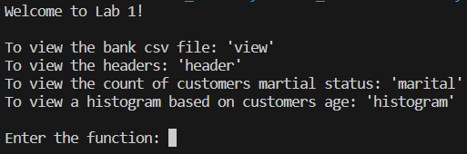
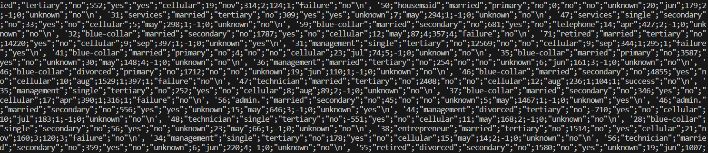
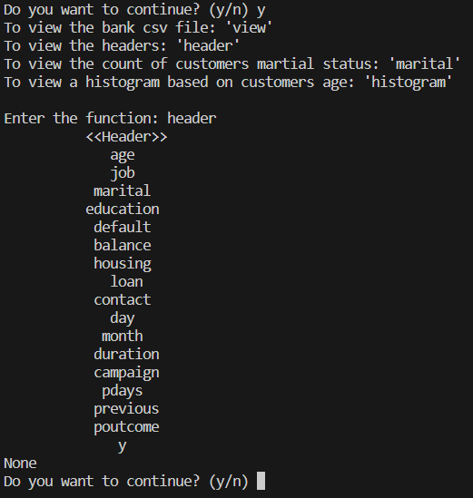
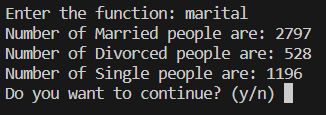
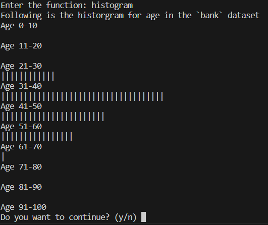

# 22112312_Chaitanya-Birla_BEA372

## Lab 1

### Objective
The objective of the lab was to create a menu-driven program with the help of functions to perform the following:
* Without using the help of any libraries, open the given dataset
* Print the headers in the file
* Find the count of customers in each category 'marital'
* Prepare a histogram for age using a print statements (You can use the scale  of 0-10,11-20,21-30...,91-100)

### Functions
* `open_csv(path)`: This function was created to access the csv file. It takes the path where the file is saved as an argument and returns the dataset, list of headers and a nested list of the data.

* `get_header(header)`: This function was created to get the headers of the given dataset. It takes a list of headers as an argument and returns the headers in a tabular format.

* `count_marital(data)`: This function was created to count the number of people in each category of `marital` column. It takes the nested list of the dataset as an argument and returns the count in each category.

* `histogram(data)`: This function was created to view a histogram based on the `age` of the customers in the dataset. It takes the nested list of the dataset as an argument and returns the histogram which has been scaled by 50.

### Usage
* To view the bank csv file, type `view`
* To view the headers, type `header`
* To view the count of customers martial status, type `marital`
* To view a histogram based on customers age, type `histogram`
* After execution of each function, you get an option to either continue or not. Enter `y` to continue or `n` to finish the programme.

### Output
* Output for `view`

* Output for `header`

* Output for `martital`

* Output for `histogram`

